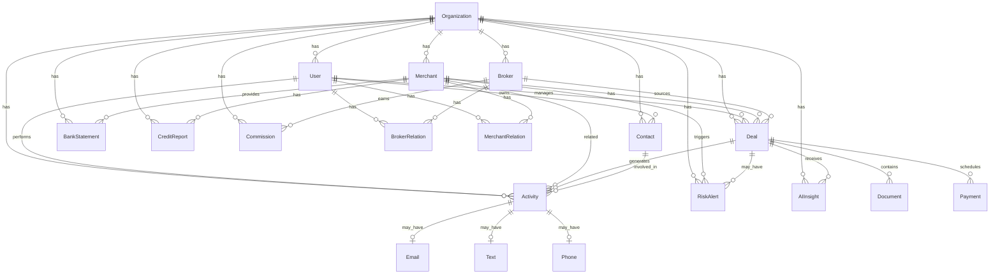

# DealSphere Database Schema Documentation

## Database Entity Relationship Diagram



## Core Entities Explained

### 🏢 Organization
**Purpose**: Multi-tenancy support - separates data between different companies using the platform.

**Key Fields**:
- `name`: Company name
- `slug`: URL-friendly identifier
- `description`: Company description

**Business Logic**: 
- Root entity for data isolation
- All other entities belong to an organization
- Enables white-label deployment

---

### 👤 User
**Purpose**: System users who can log in and perform actions. Includes both human users and AI agents.

**Key Fields**:
- `email`: Unique login identifier
- `role`: ADMIN, MANAGER, or USER permissions
- `isAIAgent`: Flag for AI-powered users
- `aiType`: Type of AI agent (if applicable)
- `capabilities`: Array of AI agent capabilities

**Business Logic**:
- Authentication and authorization
- Can manage multiple deals
- Can have relationships with brokers/merchants
- AI agents automate specific workflows

---

### 💼 Deal
**Purpose**: Core business entity - represents an MCA (Merchant Cash Advance) funding deal.

**Key Fields**:
- `dealNumber`: Unique identifier (DEAL-YYYY-XXX)
- `status`: Lifecycle state (PENDING → UNDERWRITING → APPROVED → FUNDED → PAID_OFF)
- `requestedAmount`: What merchant asked for
- `approvedAmount`: What was approved
- `factorRate`: Multiplier for payback (e.g., 1.25)
- `totalPayback`: Total amount to be repaid
- `dailyPayment`: Daily ACH amount
- `riskScore`: Traditional risk assessment
- `aiScore`: AI-based risk assessment

**Business Logic**:
- Central to the entire system
- Tracks funding lifecycle
- Connects merchants, brokers, and payments
- Generates commissions for brokers

---

### 🏪 Merchant
**Purpose**: Businesses seeking funding through MCA.

**Key Fields**:
- `businessName`: Legal business name
- `monthlyRevenue`: Key underwriting metric
- `yearsInBusiness`: Stability indicator
- `riskScore`: Creditworthiness
- `status`: ACTIVE, INACTIVE, FLAGGED, SUSPENDED

**Business Logic**:
- Primary customer entity
- Can have multiple deals over time
- Risk assessment based on financials
- Monitoring for fraud/default

---

### 🤝 Broker
**Purpose**: Third-party agents who bring deals to the platform.

**Key Fields**:
- `tier`: Performance level (GOLD, SILVER, BRONZE, NEW)
- `rating`: Quality score (0-5)
- `commissionRate`: Percentage earned on deals
- `specialties`: Industry expertise areas

**Business Logic**:
- Source of deal flow
- Earn commissions on successful deals
- Tiered system rewards performance
- Specialization improves matching

---

### 📧 Contact
**Purpose**: CRM functionality - track potential leads and relationships.

**Key Fields**:
- `type`: MERCHANT, BROKER, LEAD, PARTNER, VENDOR
- `status`: ACTIVE, INACTIVE, POTENTIAL, BLOCKED
- `relationshipScore`: Quality of relationship (0-100)
- `dealsPotential`: Expected number of deals
- `source`: How they were acquired
- `tags`: Flexible categorization

**Business Logic**:
- Lead management and nurturing
- Track relationship quality
- Source attribution for marketing
- Flexible tagging for campaigns

---

### 💳 Payment
**Purpose**: Track individual payments for funded deals.

**Key Fields**:
- `amount`: Payment amount
- `dueDate`: When payment is due
- `paidDate`: When actually paid
- `status`: PENDING, PAID, OVERDUE, FAILED

**Business Logic**:
- Daily ACH tracking
- Overdue detection
- Cash flow management
- Default prediction

---

### 📄 Document
**Purpose**: Store and track documents related to deals.

**Key Fields**:
- `type`: BANK_STATEMENT, TAX_RETURN, etc.
- `filename`: Stored file reference
- `mimeType`: File type

**Business Logic**:
- Underwriting documentation
- Compliance requirements
- Audit trail

---

### 📋 Activity
**Purpose**: Unified activity feed and task management system.

**Key Fields**:
- `type`: DEAL_UPDATE, EMAIL, PHONE_CALL, TASK, etc.
- `priority`: LOW, MEDIUM, HIGH
- `status`: PENDING, IN_PROGRESS, COMPLETED
- `scheduledAt`: For future tasks

**Relationships**:
- Can link to Email, Text, or Phone records
- Associates with Deal, Contact, or Merchant

**Business Logic**:
- Central activity tracking
- Task management
- Communication history
- Workflow automation triggers

---

### 📧 Email / 📱 Text / 📞 Phone
**Purpose**: Detailed communication tracking with status monitoring.

**Email Fields**:
- `subject`, `body`: Content
- `emailStatus`: DRAFT, SENT, DELIVERED, OPENED, CLICKED
- `threadId`: Conversation threading

**Text Fields**:
- `message`: SMS content
- `provider`: TWILIO, SENDGRID, etc.
- `status`: Delivery tracking

**Phone Fields**:
- `direction`: INBOUND/OUTBOUND
- `duration`: Call length
- `recordingUrl`: Call recording
- `outcome`: Call result

**Business Logic**:
- Omnichannel communication
- Delivery tracking
- Engagement analytics
- Compliance recording

---

### ⚠️ RiskAlert
**Purpose**: Proactive risk monitoring and alerting.

**Key Fields**:
- `type`: PAYMENT_DELAY, NSF_INCREASE, etc.
- `severity`: LOW, MEDIUM, HIGH, CRITICAL
- `resolved`: Status flag

**Business Logic**:
- Early warning system
- Automated monitoring
- Risk mitigation triggers
- Portfolio health tracking

---

### 🤖 AIInsight
**Purpose**: AI-generated insights and recommendations.

**Key Fields**:
- `type`: OPPORTUNITY, RISK, ACHIEVEMENT
- `confidence`: AI confidence score (0-1)
- `actionable`: Can be acted upon
- `priority`: Importance level

**Business Logic**:
- AI-powered analytics
- Predictive insights
- Opportunity identification
- Automated recommendations

---

### 🏦 BankStatement
**Purpose**: Financial data for underwriting.

**Key Fields**:
- `avgDailyBalance`: Account health
- `deposits`/`withdrawals`: Cash flow
- `nsfFees`: Risk indicator

**Business Logic**:
- Underwriting data source
- Revenue verification
- Risk assessment
- Trend analysis

---

### 📊 CreditReport
**Purpose**: Credit bureau data storage.

**Key Fields**:
- `creditScore`: FICO/other scores
- `tradelines`: Credit accounts (JSON)
- `collections`: Negative items (JSON)

**Business Logic**:
- Risk assessment
- Underwriting decision support
- Compliance documentation

---

### 💵 Commission
**Purpose**: Track broker compensation.

**Key Fields**:
- `amount`: Commission earned
- `rate`: Percentage rate
- `dealAmount`: Base amount
- `status`: PENDING, PAID, CANCELLED

**Business Logic**:
- Automated calculation
- Payment tracking
- Broker performance metrics

---

### 🔗 BrokerRelation / MerchantRelation
**Purpose**: Junction tables for many-to-many relationships between users and brokers/merchants.

**Business Logic**:
- User can manage multiple brokers/merchants
- Brokers/merchants can have multiple user contacts
- Tracks relationship creation date

---

## Key Design Decisions

### 1. **Soft References vs Hard Foreign Keys**
- Most relationships use hard foreign keys for data integrity
- Some fields (like `brokerId` in Deal) are optional to support direct deals

### 2. **JSON Fields for Flexibility**
- `metadata` in Activity for extensible data
- `configuration` in AI Users for settings
- `tradelines`, `inquiries` in CreditReport for complex nested data

### 3. **Enum Strategy**
- Extensive use of enums for type safety
- Prevents invalid states
- Clear business logic flow

### 4. **Audit Trail**
- Activity model provides comprehensive audit trail
- All major actions logged
- Supports compliance requirements

### 5. **Multi-tenancy**
- Organization-based data isolation
- Every entity tied to organization
- Enables SaaS model

### 6. **AI Integration**
- AI agents as special users
- AI insights as first-class entities
- Supports hybrid human/AI workflows

## Performance Considerations

### Indexes Added:
```prisma
@@index([type, status, scheduledAt])  // Activity - for task queries
@@index([userId, createdAt])          // Activity - for user feed
@@index([dealId, createdAt])          // Activity - for deal history
@@index([from, to, sentAt])           // Email - for conversation queries
@@index([threadId])                   // Email - for threading
@@index([from, to, status])           // Text/Phone - for communication queries
```

### Recommended Additional Indexes:
```prisma
// Add to Deal model
@@index([status, organizationId])
@@index([merchantId, status])

// Add to Payment model  
@@index([dealId, status])
@@index([dueDate, status])

// Add to Merchant model
@@index([organizationId, status])
```

## Security Considerations

1. **Password Storage**: Uses bcrypt hashing
2. **Data Isolation**: Organization-based separation
3. **Role-Based Access**: User roles control permissions
4. **Audit Trail**: All actions tracked in Activity
5. **PII Protection**: Sensitive data properly marked

## Scalability Notes

1. **Pagination**: All list queries should use limit/offset
2. **Eager Loading**: Use includes wisely to avoid N+1
3. **Background Jobs**: Heavy operations should be queued
4. **Caching**: Consider Redis for frequently accessed data
5. **Read Replicas**: Database can be scaled horizontally